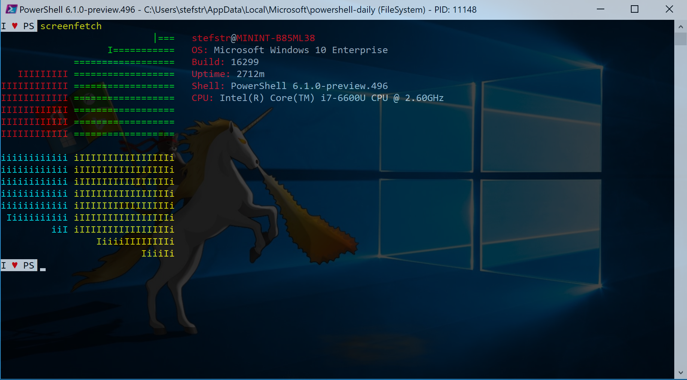

# PSScreenFetch
PowerShell Module implementing Screenfetch capabilities on Windows using PowerShell.

# ScreenFetch
According to the <a href="https://github.com/KittyKatt/screenFetch" target="_blank">Github Project information for ScreenFetch</a>, it is a "Bash Screenshot Information Tool". This handy Bash script can be used to generate one of those nifty terminal theme information + ASCII distribution logos you see in everyone's screenshots nowadays. It will auto-detect your distribution and display an ASCII version of that distribution's logo and some valuable information to the right. There are options to specify no ASCII art, colors, taking a screenshot upon displaying info, and even customizing the screenshot command! This script is very easy to add to and can easily be extended.

The PowerShell PSScreenFetch module is creating a Windows ScreenFetch capability using PowerShell.

Currently PSScreenFetch is only working on Windows 10.

